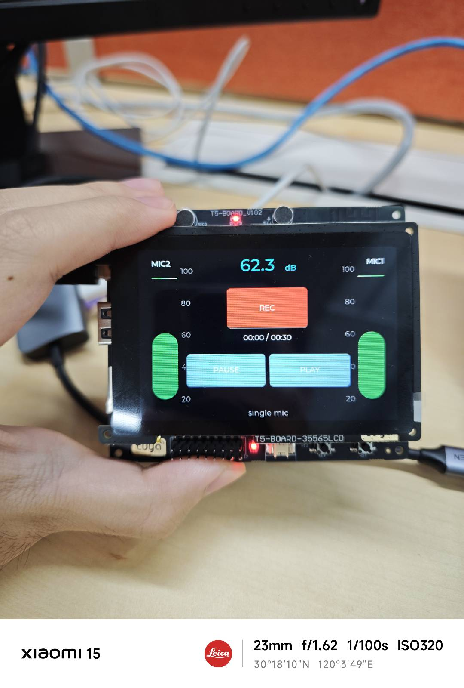

# 涂鸦 T5AI 开发板：我打的字比 agent 写的代码少两个数量级

建工程加上接官方 3.5 寸屏，前后不到一天，做出一台横屏录音机：两侧实时音量条、中间录音键（30 秒上限、覆盖式）、录音和播放都能暂停继续、外加一个实时分贝数字。应用层 931 行 C 代码，SDK 一行没动。

我一共打了二十来句话，最长的一句是这个：

> 现在屏幕显示向右旋转 90 度，变成横屏，然后两侧是麦克风动态音量条，实时显示音量，中间按键改成录音键，每次最长 30 秒，每次录音覆盖上次，在完成录音后可以播放

47 分钟后编译通过，烧进去就是这个界面。

这篇想讲的不是"AI 写代码很快"——那句话没信息量。想讲的是这块板做对了一件具体的事：**它把硬件事实写成了 JSON，交给 agent**。这件事的效果不是让 agent 写得快，是让它敢下判断、能自己验证、被 SDK 骗了也能靠实测爬回来。


---

## 一、实际过程长什么样

按顺序，我说的话和拿到的东西：

**「t5ai 有联网的能力吗」** → 得到 Wi-Fi/BLE 的确认，附 `platform.json` 的 `connectivity` 字段和平台适配层里 `tkl_wifi.c` 的完整 API 列表。不是"应该支持"，是指到文件。

**「能不能让他上网然后渲染页面了，sdk 支持不」** → 这句话被拆成了四种解读，逐个给了 SDK 支持度：设备起 web server（有现成示例）、LVGL 画在自己屏上（有）、手机面板（有工程但要绑 PID）、板子自己解析 HTML（全仓搜 `html_parse`/`litehtml`/`webview` 零命中，不支持）。我原本以为这是一个问题，实际是四条毫无共同点的路。

**「我已经接入了官方的 3.5 寸屏幕，这个开发版上有陀螺仪吗」** → 没有。板级 Kconfig 穷举了这块板全部可选硬件、板级源码里唯一的 I2C 从设备是触摸/OLED/摄像头、`board.json` 的 `peripheralPatterns` 只有八类，三处交叉确认。顺带列出了哪几块 T5 板才有 IMU（POCKET 和 PIXEL 是 BMI270，WAVESHARE AMOLED 是 QMI8658，NICEMCU 是 SH3001），以及要外接的话 I2C0 已被触摸占用。

以上三个问题连着问完，花了不到一小时，还没写一行代码。

**「让屏幕亮起来」** → 30 分钟后编译通过。改了 3 行配置、新增一个显示文件、main 里加两句。中间踩了一个编译失败，自己定位并解释了原因（见第五节）。

**那句长需求** →「一次性全部实现」→ 47 分钟后编译通过。

**「加上声贝计量数字」** → 5 分钟后跑通，定点算 dB 复用已有的 log2 表避免引浮点，主机端和 `math.h` 对照误差小于 0.6 dB。

**「现在卡死了」** → 5 分钟定位、修好、实测验证。根因是它自己写的一个整数开方函数（见第六节）。

中间还有几句是纠正和调参：「这个音量条好像比说话反应慢」、「我的手机当前环境默认分贝应该在 50，对应你的 28 分贝」、「把你对 SDK 的改动变回」。最后这句它做得挺干净——4 个文件全部还原，`git status` 干净，改动存成 70 行 patch 备用。

从「让屏幕亮起来」到收工，一共不到五小时。这里面我没有做的事：查 Kconfig 符号名、翻原理图找引脚、写 LVGL 布局代码、算 RMS、写状态机、配交叉编译。

---

## 二、为什么在这块板上能这么干

同样的 agent，换一块普通开发板，做不到上面这样。差别在四件东西上，都是这块板和 TuyaOpen IDE 提供的。

### 硬件事实是结构化数据，不是 PDF

装上 TuyaOpen IDE 扩展，它建工程时会生成两个文件：

`.tuyaopen/ide/board.json`（25KB）——这块板的全部外设，每个都带型号、接口、引脚、使能用的 Kconfig 符号、以及一个 `mounting` 字段区分焊死的和要外接的。还带 `peripheralGroups`（比如双眼屏的同显/异显两种配置）和 `expansionPins`（每个可用引脚能复用成哪些功能）。

`.tuyaopen/ide/platform.json`（34KB）——这颗芯片的片上外设，每一类都有 `enabled`（这颗 SoC 支不支持）、`count`（几个实例）、`spec`（合法的端口、引脚、取值范围、枚举）。

这个格式的意义在于**它能回答否定问题**。"有没有陀螺仪"、"I2C 有几路"、"这个引脚能不能当 UART2 TX"——这类问题在 PDF 里要靠人翻，在这里是一次字段查询。agent 最容易出错的地方从来不是写代码，是在不知道的时候假装知道；给它一份权威的机器可读事实，这类错误直接少掉一大半。

反过来，`board.json` 里没有的东西它也老实说不知道。比如板上两颗麦克风哪一颗落在芯片的 DMIC L 相——这个由 PCB 布线决定，SDK 和 JSON 里都查不到，它就在代码里留了两个宏和一段注释，让我拍一下麦克风看哪条条子动，反了就对调。

### 有 skill 管住"别乱猜"

工程里 `.claude/skills/` 装了 13 个 skill，覆盖建工程、编译、调试、烧录工具、面板开发、平台对接。其中管硬件的那个（`hardware-vibe-coding`）定了几条硬规则，我看着觉得设计得挺克制：

只为 `used-peripherals.json` 里已确认的硬件生成代码；同类外设有多个选项（这块板三种屏是 Kconfig 的 `choice`）必须问，不许自己挑；选定之后先把确认结果写进 `used-peripherals.json` 再动代码；给外设选引脚只能从 `expansionPins` 里选，且要核对该引脚的 `functions` 含所需角色；"串口"这个词有歧义（调试日志口 vs 用户 UART）必须先问清楚。

还有一条区分得很细：板级已适配的外设由 `board_register_hardware()` 统一注册，你不写 TDD 代码；你自己焊上去的，即使 SDK 里已有那颗 IC 的驱动，也得自己在 `usr_board` 里注册。判断依据是"板子适配了没有"，不是"SDK 有没有驱动"。这个区分要是搞错了，代码能编过但设备不工作，排查起来很费时间。

`used-peripherals.json` 这个设计值得单说。它是确认结果的落盘，下一轮对话又被喂回来当已确认的上下文，所以第二次做显示相关的事不用重新确认一遍。它同时驱动 IDE 里的硬件视图。一个文件同时是状态、是上下文、是给人看的图。

### 每一步都能自己验证

`tos.py` 这个命令行工具把整条链都做成了可脚本调用：

```bash
source ~/Developer/TuyaOpenIDE/TuyaOpenSDK/export.sh
tos.py config set TUYA_T5AI_BOARD_LCD_35565=y
tos.py config get                 # 验证 select 连带打开了什么
tos.py build                      # 编译，有 problemMatcher
tos.py flash                      # 烧录
tos.py monitor                    # 串口日志
```

`config get` 这一条是关键。板级 Kconfig 里 `select` 的连带关系不少，开一个 LCD 选项会连带打开 `ENABLE_DISPLAY`、`ENABLE_TP`、`LVGL_VERSION_9`、`DISPLAY_NAME`。agent 改完配置能立刻查最终生效值，不用推断。

编译产物也有信息：`dist/` 下的 QIO/UG/UA 三个 bin，加 `debug/` 里两套核（`bk7258` 和 `bk7258_ap`）的 elf/map/size_map，还有 `usr_gpio_cfg.h`。宏有没有真进固件、内存占了多少，都能查。

### 日志能读回来，所以能自己排障

这一条是前面所有条件里最重要的，因为它让"改了→不对→再改"这个过程不需要我参与。

板子插上有两个串口设备。烧录口和日志口不是同一个，日志在 `usbInterface` 编号大的那个上。搞清楚之后 agent 就能自己烧、自己抓日志、自己看结果。它在代码里埋的心跳日志长这样：

```
ui: gap=20ms heap=201000 psram=6957264 SPL~59.9 cb=2776
mic cb[1750]: rms=684 lvl=70 cost=0ms(max 1ms)
```

一行里同时有 UI timer 的实际周期、系统堆、PSRAM 堆、当前分贝、麦克风回调计数、单帧最坏耗时。后面那次"卡死"就是靠这一行直接定的位——`cb` 冻结而 `gap` 正常，说明死的不是界面。

还有一种验证不用板子：纯函数搬到 Mac 上用 `cc` 直接跑。RMS 换算曲线、整数开方的正确性、dB 公式和 `math.h` 的误差，都是这么验的。整数开方那次做了 `0~2,000,000` 逐值对比加边界值，确认和原实现完全一致。这类验证成本极低，但能挡掉一整类"看起来对"的算法错误。

---

## 三、这块板本身

回到硬件。规格挑几条要紧的：

| 项            | 值                                       |
| ------------- | ---------------------------------------- |
| 芯片 / 架构   | T5AI（BK7258）/ ARM Cortex-M33           |
| SRAM          | 640 KB                                   |
| Flash / PSRAM | 本板 8 MB / 16 MB                        |
| 连接          | Wi-Fi + BLE；无以太网、无蜂窝            |
| 功耗          | 深睡 14 µA；Wi-Fi 活动 260 mA，BLE 35 mA |

片上外设：GPIO×56、UART×3、I2C×3、SPI×4、QSPI×2、PWM×12、ADC×1、Timer×3、WDT、RTC、DMA2D、RGB、I8080、DVP，再加 KWS（唤醒词）和 VAD（人声检测）。后两个是硬件加速的，做语音交互不用自己在 M33 上跑算法——型号里那个 AI 主要指这个。

**板载焊死的只有三件**：用户按键（GPIO12，低有效）、LED（GPIO1，高有效）、音频（麦克风 + 喇叭，spk_en=GPIO28，v1.0.2+ 硬件支持 AEC）。板级 Kconfig 默认就把这三个 select 了，开箱可用。

其余都要外接：3.5 寸 LCD（ILI9488 + GT1151 触摸）、1.28 寸双眼圆屏 ×2（ST7735S）、0.96 寸 OLED（SSD1306）、摄像头（GC2145）、热敏打印机（DP-48A）、SD 卡。三种屏是 `choice`，三选一。

有两个引脚层面的事新手容易撞：`expansionPins` 列了全部 56 个 GPIO，但 GPIO1/12/28 已经被板载三件套占了；选了 3.5 寸屏之后 25 根 RGB 线加触摸的 I2C0（scl=13/sda=15）直接吃掉大半，能自由支配的不多。摄像头也走 I2C0，地址不同可以和触摸共存，但再挂别的 I2C 器件就得确认地址或换 I2C1/I2C2。

对做 demo 来说，这块板的组合是：板载语音三件套开箱可用、片上有 KWS/VAD、官方 3.5 寸屏配 LVGL v9 和触摸零配置。做"能听能看能说"的原型，起点比大多数板子高。

---

## 四、人在这个过程里干什么

我全程做的事，列出来其实挺具体：

**说清楚要什么。** 那句长需求之所以一次就实现了，是因为它把每个约束都写死了：旋转 90 度、两侧、实时、最长 30 秒、覆盖上次、录完能播。没有一处留给"你觉得应该怎样"。

**看屏幕。** agent 看不到显示。屏幕方向对不对、按钮点得动不动、置灰逻辑对不对，只有我能确认。它每次都会明确列出"需要你在板子上验证"的清单，包括"方向反了就把 `ROTATION_90` 改成 `_270`，告诉我我来改"。

**动手拍麦克风。** 哪颗 mic 对应哪条音量条，代码里查不到，只能拍一下看。

**提供物理参照。** 分贝那个数字最初按底噪估的偏移是 920，我拿手机分贝计对了一下（手机 50，它 28，差 22 dB），改成 1140 就对齐了。这类标定必须有人给外部基准。顺便说清楚：这不是校准过的声级计读数，相对变化可信，绝对值可能偏几个 dB。

**说"卡死了"。** 这一句触发的排查见下面第六节。它自己跑了 4 分钟浸泡测试没复现——因为它测的时候环境是安静的。

**做取舍。** 有一个岔路口它没替我决定：要拿到两路独立的麦克风数据，只能关掉 AEC，代价是播放录音时可能啸叫。它把两条路的代价摆出来，等我选。我选了保留 AEC。

---

## 五、它会被 SDK 骗，但能靠实测爬回来

这是我觉得最值得写的部分。agent 在这块板上的可靠性，不来自"文档写得全"，来自它能拿到实测数据反推。

第一次编译就失败了：`tdl_display_manage.h: No such file or directory`。不是代码问题——`tos.py build` 读的是 `.build/cache/using.config` 缓存，手改 `app_default.config` 不会被拾取，缓存里还是 `LCD_NONE`，所以 display 的 include 路径根本没进编译命令。`tos.py clean` 也不清这个缓存。正确做法是 `tos.py config set`，它会改配置、失效缓存、并回写文件。这个坑我觉得挺典型：文档不会写"不要手改配置文件"，但编译报错加一次源码追溯就能定位。

比这个严重得多的是下面这个。

板上物理有两颗麦克风（丝印 MIC2 在左、MIC1 在右），我想做左右独立的音量条。改 SDK 打开 DMIC 双路后，日志确认 `ch=2`，看起来成了。但两条音量条的 rms 完全相同。

根因在 `tdd_audio.c` 里一行：

```c
info.sample_ch_num = cfg.channel;   // 只回显配置枚举 STEREO=2
```

这个字段只回显你配了什么，不反映真实数据流。配了 STEREO 就恒报 2。

真相在帧长里：实测 `len=640`，而 16kHz / 20ms 单声道正好 640 字节，双声道该是 1280。数据流是单声道。信了那个字段用 stride=2 拆左右，实际是把同一路信号的奇偶采样当成了两个麦克风——这就是两边 rms 一模一样的原因。

再往下追，为什么是单声道：AEC 开启时（这块板 v1.0.2 默认开）DUAL 模式下会设 `ec_only_output=1` 和 `dual_perp=DUAL_CH_90_DEGREE`，两颗麦克风被波束成形合成了一路。所以硬件是双麦、DMIC 通路也起来了，但应用层永远拿不到两路原始 PCM。

修法是不信那个字段，按帧长推断真实通道数：

```c
uint32_t mono_bytes = sample_rate * AUDIO_FRAME_MS / 1000 * 2;
uint16_t ch = (len >= mono_bytes * 2) ? 2 : 1;
```

这个修法后来还救了一次。SDK 改动还原之后音频走回模拟麦通路，应用层一行没改就适配了——正因为通道数是算出来的，不是读来的。

值得记住的是：**结构化的硬件描述解决"板上有什么"，解决不了"运行时到底发生了什么"**。后者只能靠一个物理上必须一致的量（这里是帧长）去反推。agent 有没有这个习惯，是它能不能在嵌入式上真正干活的分水岭。

---

## 六、它也会写出自己的 bug，但能自己定位

「现在卡死了」这一句触发的排查过程，我觉得比结论更有意思。

它的第一反应和我一样：内存泄漏或 PSRAM 碎片。毕竟界面上 6 个 LVGL label 每 20ms 全量重写，`lv_label_set_text` 每次都走 `lv_realloc`，每秒 300 次 PSRAM 堆 realloc，非常可疑。

但它没直接改，先跑了 4 分钟浸泡测量。结果推翻了假设：系统堆 `201028` 纹丝不动，PSRAM 堆 `6957252` 纹丝不动，麦克风回调持续增长，卡死没复现。

不过测量暴露了另一个真问题：UI timer 设定 20ms，实际 `gap=32~35ms`，持续超载 60~75%。那 6 个 label 的全量重写叠加 480×320 的软件逐像素旋转，把 LVGL 线程吃满了。改成只在值真正变化时才写（dB 变了才写 dB，秒变了才写时间），`gap` 回到稳定 20ms。这个不是卡死根因，但让线程有了余量。

真正的现场是这样：

```
ui: gap=20ms heap=201000 psram=6957264 SPL~59.9 cb=2776
ui: gap=20ms heap=201000 psram=6957264 SPL~59.9 cb=2776   ← cb 完全不变
```

LVGL timer 准点在跑、堆没变化，但麦克风回调计数冻结了。所以"界面死掉"其实是数据源断了，UI 一直活着。这一行日志直接砍掉了一整个排查方向。

根因是它自己写的这段：

```c
static uint32_t __isqrt32(uint32_t v) {
    uint32_t r = 0;
    while ((r + 1) * (r + 1) <= v) r++;   // 迭代次数 = rms 本身
    return r;
}
```

这个函数在麦克风回调里每 20ms 跑一次，迭代次数正比于音量：

| 场景 | rms   | 线性迭代 | 二分迭代 |
| ---- | ----- | -------- | -------- |
| 底噪 | 11    | 11       | 4        |
| 说话 | 2000  | 2000     | 11       |
| 大声 | 20000 | 20000    | 15       |

大声时要做两万次乘法加比较，一帧处理不完，音频驱动缓冲溢出，采集永久停止，之后再也不恢复。

所以不是"运行时间过长"，是"遇到一次足够大的声音"。它 4 分钟浸泡全程安静（rms 11~35，才十几次迭代），怎么跑都不出问题。它自己也把这一点写清楚了：测试方法有盲区，浸泡测试只覆盖了时间长度，没覆盖输入的取值范围。

修法是 restoring binary square root，固定 16 轮迭代、无乘法、与音量无关。正确性在 Mac 上逐值验过，实测最坏耗时 1ms，相对 20ms 帧预算有 20 倍余量。

我想说的不是"agent 会写 bug"——人写这个函数一样会犯。值得注意的是它能从一句「现在卡死了」走到根因：先量化再假设、假设被数据推翻就换方向、拿到冻结的现场日志、锁定自己写的热点、在主机上验证修法、再烧回去实测。这条路走通的前提，就是第二节那四个条件。

---

## 七、想复现的话

最短路径，不用先读文档：

1. 装 TuyaOpen IDE 扩展（VSCode / Cursor），首次启动它会后台 clone SDK。中文环境走 Gitee，其他走 GitHub，可以用 `tuyaopen.gitMirror` 改。
2. 建工程，选 platform `t5ai`、board `TUYA_T5AI_BOARD`。生成的 `.tuyaopen/ide/board.json` 和 `platform.json` 就是后面所有硬件问题的答案来源。
3. 接上 3.5 寸屏，然后直接对 agent 说"让屏幕亮起来"。它会先确认你用哪块屏（三种屏是 choice，它按 skill 规则必须问），写进 `used-peripherals.json`，再改配置写代码。
4. 找准日志串口——两个设备里 `usbInterface` 编号大的那个。这一步值得提前做，它决定了后面 agent 能不能自己排障。
5. 然后就是描述你想要的效果。约束写死，别留"你觉得应该怎样"。

一个建议：让它在界面上留一行心跳日志，把 timer 周期、堆水位、关键回调计数打在一起。这行日志的成本是十分钟，第一次排障就能回本。

---

## 八、判断

适合拿这块板做 demo 的情况：想快速验证"能听能看能说"的原型；愿意接涂鸦生态（DP 建模、手机面板、OTA 都是现成的）；愿意让 agent 读 SDK 源码——上面所有硬件结论都是从板级 Kconfig 和适配层一路追出来的，能给到文件行号。

不合适的情况：想要多传感器（板载只有三件，没有 IMU，引脚被屏幕吃掉大半，得自己焊或者换 POCKET/PIXEL）；需要有线网或蜂窝（只有 Wi-Fi + BLE）；想在设备上渲染 HTML（没有浏览器内核，别抱这个幻想）。

至于"AI 结合"这件事，我的判断是：这块板真正做对的不是塞了个大模型进去，是把硬件事实写成了机器可读的格式，并且给编译、烧录、日志留了脚本入口。这几件事听起来都不性感，但它们决定了 agent 是在猜还是在查。

---

## 九、结论

一天做出一台带音量条和分贝表的横屏录音机，931 行代码我一行没写。但这不是"AI 很强"能解释的——同一个 agent 面对一块只有 PDF 数据手册的板子，得先花半天从原理图里找引脚，还不一定找对。

差别在四件事上：硬件事实是 JSON 而不是 PDF；skill 规定了确认之前不许写代码；`tos.py` 让每一步都能查最终生效值；串口日志能读回来，所以"改了→不对→再改"不需要我参与。

如果只带一条走：**给 agent 的不该是文档，是可查询的事实和可验证的回路。** 这块板在这两点上做得比我预期的好。

---

## 参考

- T5-AI-Board 官方文档：https://tuyaopen.ai/zh/docs/hardware-specific/tuya-t5/t5-ai-board/overview-t5-ai-board
- 原理图 PDF：https://images.tuyacn.com/content-platform/hestia/174243908480e34e64d08.pdf
- 板级源码 `TUYA_T5AI_BOARD`：https://github.com/tuya/TuyaOpen/tree/master/boards/T5AI/TUYA_T5AI_BOARD
- TuyaOpen 仓库：https://github.com/tuya/TuyaOpen
- 淘宝：https://item.taobao.com/item.htm?id=941011375911　｜　Amazon：https://www.amazon.com/dp/B0FZKBVHP2

> 文中引脚、型号、Kconfig 符号、字段名均来自 TuyaOpen SDK 与 IDE 生成的 `board.json` / `platform.json`，截止 2026-08-25。SDK 主线在动，具体位置可能漂移。
