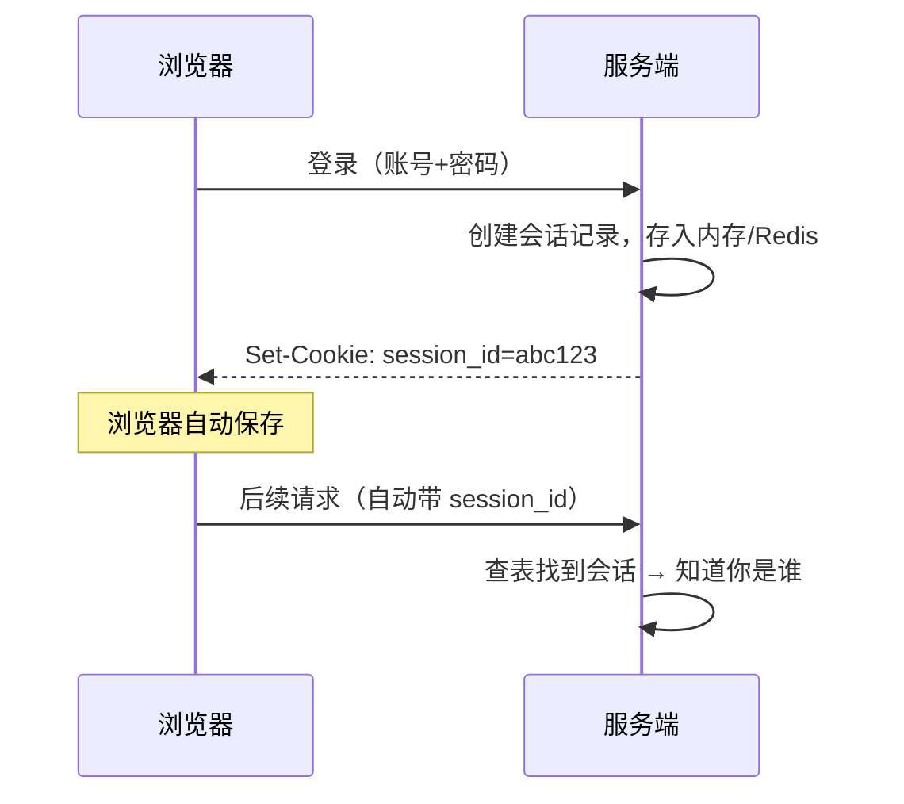
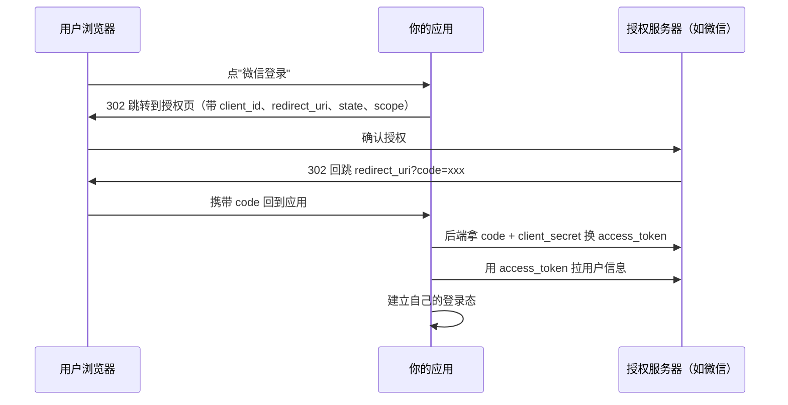
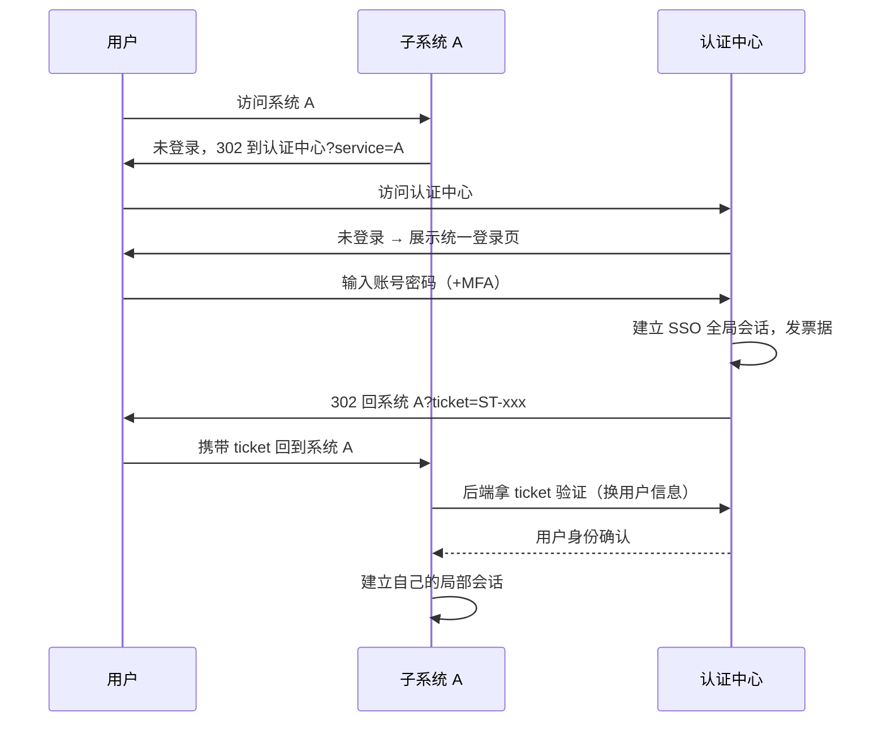

# 登录鉴权一次讲清：Cookie、Session、JWT、SSO 与权限

## 作者：梦泽　时间：2026-09-23　

## 0. 根因：HTTP 是无状态的

先说所有这些技术要解决的同一个问题。

HTTP 协议本身没有记忆：服务器处理完一个请求就把你忘了，下一个请求进来，它不知道刚才那个人和你是不是同一个。但业务需要记忆——购物车要有归属，订单要能查，后台要分角色。

于是所有的登录方案，本质上都在回答三个问题：

1. **"你是谁"这个记忆放在哪？** 放客户端、放服务端、还是放第三方？
2. **这份记忆怎么防伪造、防偷窃？**
3. **记忆的范围有多大？** 一个应用、一个域名、还是一组系统？

Cookie / Session / JWT / SSO 不是四个并列的知识点，而是一条演进线：每一种都是在前一种留下的问题上长出来的。读完这一篇，希望你能自己把这条线推出来。

## 1. Cookie：浏览器端的"手环"

Cookie 是浏览器提供的存储与自动携带机制：服务器通过响应头下发，浏览器存起来，之后**每次**请求同域都自动带上。

```http
HTTP/1.1 200 OK
Set-Cookie: session_id=abc123; Domain=.example.com; Path=/;
  Max-Age=86400; Secure; HttpOnly; SameSite=Lax
```

五个属性决定了 Cookie 的一切行为，后面的安全和 SSO 都建立在这上面：

| 属性                  | 作用          | 埋下的伏笔                                                  |
| --------------------- | ------------- | ----------------------------------------------------------- |
| `Domain` / `Path`     | 生效范围      | `Domain=.tuya-inc.com` 可让多个子域共享——SSO 同域方案的地基 |
| `Expires` / `Max-Age` | 生命周期      | 不设就是会话 Cookie，关浏览器即失效                         |
| `HttpOnly`            | JS 读不到     | 防 XSS 偷取                                                 |
| `Secure`              | 仅 HTTPS 传输 | 防中间人                                                    |
| `SameSite`            | 跨站是否携带  | Strict / Lax / None，防 CSRF 的主力                         |

一个关键认知：**Cookie 只是载体，本身没有"登录"语义**。往里面放什么、怎么验证，是后话。它有两个天然特点也先记住：一是浏览器**自动携带**（这是它易用和 CSRF 风险的共同根源），二是**只存在于浏览器**（这是 APP 和小程序用不了它的原因）。

## 2. Session：把记忆放在服务端

最早的完整登录方案。流程：



服务端存状态（通常是 Redis 里的一个 hash：用户 ID、角色、过期时间），客户端只拿一个不透明 ID。优点很实在：

- 状态在服务端，**踢人、封号、改权限立即生效**——把 Redis 里那条记录删了就行
- 客户端拿到的只是一个随机串，看不到任何内容

代价在分布式部署时暴露出来：下一次请求可能打到另一台机器，它怎么找到你的会话？三条路：

1. **粘性会话**（sticky session）：负载均衡把同一用户固定打到同一台。简单，但机器挂了会话全丢，扩缩容会打散分布。
2. **会话复制**：每台机器互相同步全量会话。小集群能撑，规模大了广播开销不可接受。
3. **集中存储**：会话放 Redis，应用服务无状态化。**这是当前绝对主流**，Spring Session 等框架开箱即用。

Session 还遗留一个问题：浏览器自动带 Cookie 这个特性，可以被恶意网站利用——你在 A 网站登录着，又访问了恶意网站 B，B 的页面里藏了一个向 A 发请求的表单，浏览器会**带着你的 Cookie** 去发这个请求，A 分不清这是不是你本人点的。这就是 **CSRF**。它的根源是"浏览器自动带凭证"，所以有人干脆转向一种不会被自动携带的凭证——Token。

## 3. JWT：把记忆签完名还给客户端

JWT（JSON Web Token）把服务端的会话记录做成一段自包含的字符串发给客户端，服务端只留一个签名密钥。结构三段式，用 `.` 分隔：

```
eyJhbGciOiJIUzI1NiJ9.eyJ1aWQiOiJtZW5nemUiLCJyb2xlIjoiYWRtaW4iLCJleHAiOjE3OTA1MTIwMDB9.Xk8s...
  Header（算法）         Payload（内容）                        Signature（签名）
```

服务端验证时用密钥重算签名比对，一致则信任 Payload 里的内容。**签名保证不可篡改，但不保密**——Payload 只是 Base64，任何人解码就能读。所以 uid、过期时间可以放，手机号、密码绝不能放。这是 JWT 最常见的误区。

核心转变一句话：**状态从服务端搬到客户端，服务端从"查库"变成"验签"**。

好处：无状态、水平扩展天然友好、跨服务共享只需分发验证密钥。代价也随之而来：

### 3.1 最大的代价：无法主动失效

Session 时代踢人是删一条记录；JWT 时代，签出去的 token 在过期前**永远有效**——服务端不存它，就没办法撤销它。登出按钮、封号、改密码后旧 token 依然能跑，这在很多场景不可接受。

工程上的组合解法：

- **短命 access token + 长命 refresh token**。access token 只给 15 分钟，泄露的损失窗口小；refresh token 有效期长但**保存在服务端可查可控**，登出/踢人/改密码时把它作废即可。客户端拿 refresh token 换新 access token，静默续期。
- **黑名单**。撤销操作少时，把要作废的 token（或其 jti）丢进 Redis，验证时多查一步。牺牲一点无状态性，换回控制力。
- **版本号**。用户表里放一个 token_version，签发时写进 Payload，验证时比对。改密码把版本号 +1，该用户所有旧 token 全部失效。实现最简单，适合"全端下线"场景。

### 3.2 签名算法怎么选：HS256 vs RS256

- **HS256**（对称）：签发和验证用同一个密钥。快，但每个需要验证 token 的服务都得持有密钥——持有密钥就能伪造 token。服务一多，密钥扩散是安全隐患。
- **RS256**（非对称）：私钥签发、公钥验证。公钥可以随便发，认证中心独占私钥，各业务服务拿公钥验即可，验不了也造不了。**微服务/多团队架构下应该默认 RS256**，配合 JWKS 端点做公钥分发和 `kid` 密钥轮换。

单体应用或验证方就是签发方自己，HS256 够用且更省事。

### 3.3 并发刷新竞态：真实的坑

access token 过期时，页面上往往同时发出五六个请求，它们**各自**发现 401，**各自**拿同一个 refresh token 去换新 token。第一个请求成功后把 refresh token 轮换作废，后面几个全部失败，用户被莫名登出。

标准解法是客户端做**单飞（single-flight）**：第一个发现过期的请求发起刷新，其余请求等待刷新结果后用新 token 重放，而不是各自去刷新。Axios 的拦截器、各端 HTTP 库里都要自己实现这一层。后端侧也要注意：refresh token 轮换时给旧 token 几十秒的宽限期，容忍时钟和并发误差。

### 3.4 Session vs JWT 对比

|            | Session             | JWT                              |
| ---------- | ------------------- | -------------------------------- |
| 状态存储   | 服务端（Redis）     | 客户端自持                       |
| 主动失效   | 天然支持            | 难，需黑名单/版本号/refresh 机制 |
| 服务端开销 | 每请求查一次存储    | 只验签，无 IO                    |
| 跨服务共享 | 存储要共享          | 分发公钥即可                     |
| 非浏览器端 | 不适用（没 Cookie） | 天然适用（放 Header）            |
| CSRF       | 有风险              | 无此问题（不自动携带）           |
| 凭证大小   | 一个短 ID           | 每个请求背着整个 Payload         |

没有绝对赢家。**浏览器为主的单体/传统应用，Session + Redis 依然是最省心的方案；多端混合、微服务间传递身份，JWT 是标配**。

## 4. 多端登录态：APP 和小程序不认 Cookie

上面整套 Cookie 机制只在浏览器里成立。原生 APP 和小程序没有这个基础设施，差异体现在两点：

**携带方式**：token 放请求头（`Authorization: Bearer xxx`），不依赖浏览器行为，所以 CSRF 对它们天然免疫。

**存储位置**：浏览器里 localStorage 和 Cookie 之争，到了原生端变成 Keychain（iOS）/ Keystore（Android），系统级加密存储，安全性反而高于 Web 端。

多端带来的新问题是**多设备会话管理**：

- **互踢还是并存**？IM 类通常多端并存（手机+电脑同时在线，但要区分设备类型）；银行类强制互踢。实现上就是把"一个用户一个会话"改成"一个用户 N 条会话记录"，每条绑定设备 ID。
- **改密码全端下线**：Session 方案删掉该用户全部会话；JWT 方案用 3.1 的版本号，一改全失效。
- **设备信任分级**：常用设备免短信、新设备强制二次验证，风控的基本盘。

## 5. OAuth2.0 与 OIDC：让"别人家"替你证明身份

先纠正一个最常见的混淆：**OAuth2.0 是授权协议（authorization），不是登录协议（authentication）**。它解决的问题是"我在不把密码给你的前提下，授权你访问我在别处的资源"。真正的第三方登录是在 OAuth2 之上加了一层身份规范，叫 **OIDC**（OpenID Connect）。

OAuth2 的四个角色：资源所有者（用户）、客户端（你的应用）、授权服务器（微信/IUC）、资源服务器。四种授权模式里，重点掌握两个：

**授权码模式（authorization code）**——最经典的"用微信登录"：



注意两个安全设计：code 是一次性的且走浏览器（泄露窗口小），真正的敏感换取在后端带着 client_secret 完成。`state` 参数用来防 CSRF（回跳时校验是不是自己发起的流程）。

**PKCE**——SPA、移动端这些"存不住 client_secret"的场景的标准做法：客户端先发一个随机挑战值，换取 token 时必须带上对应的验证值，等效于给没有密钥的客户端配了一次性密钥。**现在官方建议所有客户端都默认用 PKCE**，不再区分有没有后端。

把伏笔收回来：OIDC 在 OAuth2 流程上多返回一个 `id_token`，而它**就是一张 JWT**——`iss`（谁签发的）、`sub`（哪个用户）、`aud`（发给谁的）。第 3 节学的验签知识在这里原样复用。

## 6. SSO：一次登录，处处通行

SSO 解决的是第三个问题——记忆的**范围**。场景：公司有二三十个内部系统，不可能让每个系统各配一套账号密码。

### 6.1 同域方案：父域 Cookie 共享

如果所有系统都挂在一个主域下（`a.tuya-inc.com`、`b.tuya-inc.com`），把登录 Cookie 的 `Domain` 设成 `.tuya-inc.com`，子域之间天然共享。实现最简单，但有三个限制：必须同主域（跨公司域名无解）、Cookie 只能放一个（多系统会互相覆盖）、子域名划分被登录方案绑架。适合系统少的初期，规模化后都要走认证中心。

### 6.2 跨域方案：统一认证中心 + 票据

经典 CAS 流程（内网 SSO 的普遍模式）：



之后访问系统 B 时，B 同样把你 302 到认证中心，但认证中心已经有你的全局会话了，**不发登录页直接发票据**——这就是"单点"的含义：登录一次，之后各系统的跳转都是无感的。我们每天用的内网系统跳统一登录页、token 过期自动重定向回来，背后就是这个流程。

CAS 与现代 OIDC 的区别主要在票据格式和生态：CAS 的 ticket 是不透明串要回认证中心换，OIDC 直接发可本地验签的 `id_token`（JWT），少一次网络往返。企业内部还有 SAML（XML 体系，传统企业软件多用），互联网公司新系统基本都收敛到 OIDC 了。

### 6.3 单点登录容易，单点登出难

一个常被漏掉的需求：用户在认证中心点了退出，各子系统的局部会话怎么清？CAS 有单点登出协议（认证中心向各已注册子系统广播登出通知），但实现依赖各系统正确注册回调；很多自研方案干脆退化成"只在认证中心登出，子系统靠会话过期自然失效"——这在后台管理系统里是个要主动决策的安全点，不是细节瑕疵。

## 7. 网关鉴权与服务间信任

前面的讨论都假设"验证"发生在业务服务自己身上，现代架构里这一层大多上移到了网关：

- **验证在网关统一做**：验签、过期检查、黑名单、限流，业务服务只接收网关注入的用户身份头（如 `X-User-Id`）。好处是各业务不用重复实现鉴权逻辑；代价是**必须信任这些头**——如果网关后面还有端口能被直接访问，攻击者伪造一个 `X-User-Id` 头就等于伪造了登录。所以网关之后的网络要做隔离，业务服务只接受来自网关的流量。
- **服务间调用凭什么信任**：内网不等于安全。服务间通信要么透传用户身份继续走用户态鉴权（用户触发、权限跟用户走），要么走服务身份（service account / mTLS / 内部签名）——后者用于定时任务、异步消息这类"没有用户"的调用。
- **多协议网关的差异**：以我们日常接触的 fusion / highway 为例，同一个接口注册到网关后，鉴权方式、参数映射、免登白名单都是注册时声明式的配置，不在业务代码里。排查"接口 401/被拒"时第一步要看的是网关层的注册配置和 match 结果，而不是先怀疑业务代码——之前排查过导出接口报 `API_OR_API_VERSION_WRONG`，实际请求在网关 match 阶段就被拒了，根本没到后端。

## 8. 权限模型：登录只回答"你是谁"

Authentication（认证）和 Authorization（授权）是两层，经常被混为一谈。登录成功只完成前者；"这个用户能调这个接口、能看这行数据"是后者，需要单独的模型：

- **RBAC**（基于角色）：用户 → 角色 → 权限。后台管理系统的主流，简单直接。要点是角色别爆炸——出现"超级管理员2""临时运营1"这种角色时，说明该重新梳理权限点了。
- **ABAC**（基于属性）：按属性规则动态判定，如"仅本部门"、"仅工作时间"。灵活但规则难审计，通常 RBAC 打底、个别场景 ABAC 补充。
- **数据权限**：业务系统里最常见的实际需求是行级权限——"你只能看自己门店的订单"。实现通常是查询层注入归属过滤条件（组织/门店 ID 链），要注意的不只是过滤本身，还有**越权细节**：能看列表不等于能看详情，前端隐藏按钮不等于后端校验了。

JWT 里要不要放角色？放了可以省一次查询，但**改权限无法立即生效**（token 在用户手里）。常规做法是 token 里只放身份，权限每次实时查或短 TTL 缓存——和数据权限的实时性要求一致。

## 9. 安全专题：XSS、CSRF 与加固清单

### 9.1 XSS vs CSRF：两种不同的攻击

|        | XSS                                      | CSRF                               |
| ------ | ---------------------------------------- | ---------------------------------- |
| 原理   | 往页面注入脚本，在**你的页面里**执行代码 | 恶意网站**借你的浏览器**发跨站请求 |
| 偷什么 | 直接偷 Cookie/ token、冒充你做任何操作   | 不能偷，只能"借刀"发一次请求       |
| 根源   | 服务端把用户输入当 HTML 渲染             | 浏览器自动携带 Cookie              |
| 防御   | 输出转义、CSP、HttpOnly（偷不走）        | SameSite、CSRF token、校验 Origin  |

一个关键推论：**HttpOnly 防 XSS 偷 Cookie，但防不了 XSS 本身**——脚本能跑，就能直接以你的身份发请求。所以 HttpOnly 是纵深防御的一层，不是 XSS 的解。

### 9.2 Token 存哪：localStorage 还是 Cookie

Web 端存 JWT 的经典争论。localStorage 读取方便但 **XSS 可读**；`HttpOnly` Cookie JS 读不到，但引入 CSRF 面和 Cookie 的各种限制。我的结论倾向：**要自动携带的用 HttpOnly + SameSite Cookie，SPA 里需要 JS 主动用的 token 接受 localStorage 但把 XSS 防御做扎实（CSP、依赖审计）**。真正的答案是"无论存哪，XSS 得手都等于登录态失守"——存储位置只决定被偷的难度，不决定是否失守，别把宝押在存储上。

### 9.3 加固清单（照着做）

- Cookie 全套：`Secure` + `HttpOnly` + `SameSite`，一个都不能省
- access token 短有效期（分钟级），refresh token 服务端可撤销、带设备绑定
- refresh token 轮换 + 宽限期，防并发刷新竞态
- 改密码 / 异地登录 → 全端会话失效（版本号或会话记录清理）
- 敏感操作（改绑手机、提现）二次验证，不信任"已登录"本身
- 登录接口：验证码 + 频控 + 失败锁定，防撞库
- 日志里永远不打完整 token，脱敏到前 8 位即可

## 10. 进阶两节（选读）

### 10.1 扫码登录的原理

和 SSO 同构，只是"证明身份"的动作从输密码换成了手机扫码：

- PC 端请求二维码：服务端生成一个带唯一 `qrcode_id` 的码，状态为**待扫描**；
- 手机扫码：App（已登录）把 `qrcode_id` + 自己的凭证提交给服务端，状态变**已扫描待确认**——注意这里多一个中间态，是为了让用户在手机上再按一次"确认登录"，防止扫错码直接上线；
- 手机确认：状态变**已确认**，服务端为该 `qrcode_id` 生成 token；
- PC 端一直在轮询（或长连接/WebSocket）查询这个 `qrcode_id` 的状态，拿到 token，登录完成。

二维码本质是一个**移动端到 PC 端的身份传递票据**，和 CAS 的 ticket 思路一致，只是方向反了。

### 10.2 无密码：MFA 与 Passkey

- **MFA**：密码之外的第二因子。TOTP（动态口令）、短信（防刷成本高、有 SIM 卡劫持风险）、推送确认。内部系统接 MFA 的优先级高于多数人以为的程度。
- **Passkey / WebAuthn**：用设备密钥对替代密码——私钥留在设备，服务端只存公钥，登录即签名验证。不可钓鱼（域名绑定）、不可撞库，Apple/Google/主流密码管理器已全面支持。新建系统值得直接把 Passkey 列进登录方式的选项里。

## 11. 收尾：决策树与 FAQ

### 11.1 一张决策树

```
要解决什么？
├─ 单体应用、纯浏览器 → Session + Redis（HttpOnly Cookie）
├─ 多端（APP/小程序）或微服务间传身份 → JWT（RS256，access+refresh）
│    └─ 需要踢人/审计 → 叠加 Redis 黑名单或版本号
├─ 要接第三方登录 → OAuth2 授权码（+PKCE），身份层用 OIDC
├─ 多个内部系统统一登录 → 认证中心 + 票据（CAS/OIDC）
│    └─ 都在同一主域下且系统少 → 父域 Cookie 也可接受
└─ "你能干什么" → RBAC 打底 + 数据权限注入，与登录态分层
```

### 11.2 高频问题速答

1. **JWT 怎么主动失效？** 短有效期 + refresh token 服务端可撤销是基本盘；强需求上黑名单或版本号。
2. **JWT 安全还是 Session 安全？** 机制本身无优劣，取决于实现。JWT 的失效管理更容易被做错，Session 的存储扩展更容易被做重。
3. **分布式 Session 怎么做？** 集中存 Redis，应用无状态。粘性和复制只在小规模下考虑。
4. **OAuth2 和 SSO 什么区别？** OAuth2 是授权协议；SSO 是"一次登录处处通行"的目标，可以用 CAS/SAML/OIDC 实现，而 OIDC 恰好构建在 OAuth2 之上。
5. **id_token 和 access_token 什么区别？** id_token 证明"你是谁"（给客户端解析），access_token 授权"你能调什么"（给资源服务器校验），别混用。
6. **为什么 token 放 Header 就没有 CSRF？** CSRF 依赖浏览器自动带 Cookie；Header 是代码显式加的，第三方网站触发不了。
7. **Cookie 的 SameSite=None 为什么要配 Secure？** 浏览器规范强制：允许跨站发送的 Cookie 必须只在 HTTPS 下传，否则浏览器直接拒绝。
8. **JWT 能放敏感数据吗？** 不能。Payload 是 Base64 不是加密，谁都能解码。
9. **密码重置后怎么让旧登录态全失效？** Session 删记录；JWT 版本号 +1 或吊销 refresh token。
10. **refresh token 为什么要轮换？** 检测盗用：轮换后旧 token 若再次被使用，说明泄露了，可立即作废整条链。

### 11.3 踩坑清单（从真实排障里来的）

- Cookie 跨域带不上：先查 `SameSite`/`Secure` 组合，再查 Domain 是否精确到了子域（带子域前缀的 Domain 属性在部分浏览器下行为不同）。
- 刚签发的 JWT 被拒：签发方和验证方**时钟偏移**，验证侧加几十秒 leeway。
- 请求过网关后 401：网关可能不透传 `Authorization` 头，或注册配置里鉴权方式与预期不符——先看网关层，别先怀疑业务代码。
- 用户登出了但还能操作：只清了客户端 token，refresh token / 服务端会话没作废。
- 第三方 Cookie 被 Chrome/Safari 逐步封杀，靠第三方 Cookie 的跨站方案要尽早迁移。
- "前端隐藏了按钮"不等于权限控制——每个接口都要在后端做权限校验。

## 参考

- MDN — Set-Cookie 与 Cookie 属性：https://developer.mozilla.org/zh-CN/docs/Web/HTTP/Headers/Set-Cookie
- RFC 6265（Cookie 规范）：https://datatracker.ietf.org/doc/html/rfc6265
- RFC 7519（JWT）：https://datatracker.ietf.org/doc/html/rfc7519
- RFC 6749（OAuth 2.0）：https://datatracker.ietf.org/doc/html/rfc6749
- RFC 7636（PKCE）：https://datatracker.ietf.org/doc/html/rfc7636
- OpenID Connect Core：https://openid.net/specs/openid-connect-core-1_0.html
- CAS 协议：https://apereo.github.io/cas/7.0.x/protocol/CAS-Protocol.html
- WebAuthn / Passkey：https://webauthn.guide/
- OAuth 2.0 for Browser-Based Apps（官方最佳实践）：https://datatracker.ietf.org/doc/html/draft-ietf-oauth-browser-based-apps
