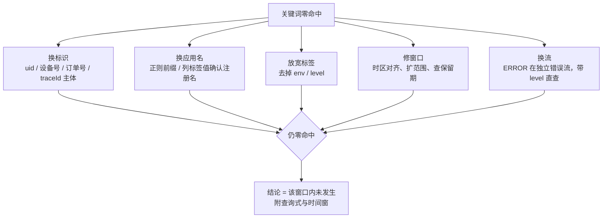

# Loki 日志排障指南

日志排障中一个常见的误判是「日志里没有，所以没发生」。用 Loki 查了两个多月线上问题之后，我的体会正好相反：**零命中大概率是查询姿势错了**——应用名猜错、标签多带了一个、时间窗差了八小时、TID 跨了服务变形。这篇把实战里反复踩过的坑和验证过的方法收拢成一份通用指南，不绑定任何具体项目，换成你的应用名和关键词就能用。

## Loki 是怎么找日志的

理解它的索引方式，很多「查不到」瞬间就能解释。

Loki 不索引日志正文，只索引**标签**（label）。一组标签组合（比如 `application="xx", env="prod"`）圈出一条**日志流**（stream），查询时先用标签定位流，再在流里逐行过滤关键词。这意味着：

- 标签写错一个字符，直接换到另一条流，正文里关键词再多也是零命中；
- 同一个应用的不同输出（info.log / error.log）可能配置成不同的流——你关键词扫的流里根本没有错误行；
- 正文不过滤索引，所以大范围全量扫描很慢，查询要靠「标签收窄 + 短时间窗」控制成本。

另外它按流存储、有保留期，过期即物理删除。查不到的另一种解释是：**这段日志已经不存在了**。

## 排障四要素

每次查询前先在脑子里填四个空：**区域、应用、时间窗、主线标识**。缺任何一个都是盲查。

**区域**。多区域部署时日志按区域分集群，先确认用户/设备落在哪个区。区域搞错是「零命中」的经典原因——服务跑在新加坡，你查的是中国区。

**应用**。最容易被低估的一步：**应用名 ≠ 仓库名 ≠ 服务名**。注册到日志平台的名字经常和代码仓名不同，用仓名去查就是查空。不确定时先列应用标签值，或用正则前缀匹配探一下：

```logql
{application=~"<前缀>.*"}   # 模糊确认应用到底注册成了什么名字
```

**时间窗**。两个坑：一是日志时间戳有 UTC 有本地时区，按错误时区设窗口会整个错开；二是保留期（我们环境里部分应用只保留 7 天，以实际为准），窗口设到保留期外不是「没有」，是「永远没有了」。

**主线标识**。按你手里的线索选，见下表。

| 你手里的线索 | 该查哪里 | 说明 |
|---|---|---|
| 接口名（如云 API / HTTP path） | 入口网关 access log | 只在网关日志里有；后端服务日志通常只有 RPC 的 interface + method |
| traceId / TID | 全链路 | 跨服务传递的主力标识，但有变形坑（下文） |
| uid / 设备号 / 订单号 | 业务服务 | 先在业务服务定位，再换 traceId 扩链路 |

## 标准三步：入口 → 链路 → 定性

**第一步，入口层确认请求到达与成败。** 查网关 access log（通常是 JSON 格式），关注四个字段：接口名、成败标志、耗时（rt）、响应体摘要，顺带拿到 traceId。这一步就能回答「请求到底进来没有」「是网关就挂了还是后端挂了」。

**第二步，用 traceId 追服务链路。** 拿 traceId 查目标应用，把一次请求在各服务里的日志按时间排起来，就是完整生命周期。

这里有个高频坑：**traceId 跨进程会变形**。常见格式是 `主体.序号`，请求每跳一跳，后缀就变一次。所以用**完整 traceId 精确匹配会漏掉链路的另一半**——上游的接收日志和下游的处理结论日志，traceId 主体相同、后缀不同。正确姿势是用 traceId 的**主体前缀**过滤。

**第三步，定性。** 三类：
- **超时**：对比网关 rt 和各服务分段耗时，大头在哪一跳一目了然；
- **异常**：去 error 流拉堆栈，定位到类和行号；
- **数据问题**：对照入参和中间结果，区分「没查到」和「查到但被拒」。

查询纪律：**先用 30 分钟短窗口验证查询式有效，再扩窗口**。网关类应用日志量巨大，大窗口 + 宽关键词必超时。

## LogQL 够用的部分

行过滤，四个符号走天下：

```logql
{application="xx"} |= "订单号"          # 包含
{application="xx"} |= "a" |= "b"       # 多条件叠加（AND）
{application="xx"} |~ "error|timeout"  # 正则
{application="xx"} != "debug"          # 排除
```

解析器，把非结构化日志变字段：

```logql
{application="xx"} | json | rt > 1000        # JSON 日志按字段过滤
{application="xx"} | logfmt | level="error"  # logfmt
```

度量聚合，回答「多少、趋势、分布」：

```logql
count_over_time({application="xx"} |= "error" [5m])      # 错误量趋势
sum by (application) (count_over_time({application=~"a|b|c"} |= "订单号" [10m]))
                                                          # 一个标识落在哪些应用
sum by (host) (count_over_time({application="xx", level="ERROR"} [1h]))
                                                          # 错误按实例分布
quantile_over_time(0.99, {application="xx"} | json | unwrap rt [5m])
                                                          # 耗时 P99
```

最后一条 `sum by (application)` 值得单独说：**一个请求往往散落在多个应用里**——网关一份、业务服务一份、下游依赖各一份。只盯一个应用会漏掉整条链路。这个查询先告诉你「这个订单号/traceId 在过去 10 分钟里都路过了谁」，再逐个拉明细。

## 十五个真实踩过的坑

按「现象 → 为什么 → 怎么办」写。前五条都曾直接导致过错误结论。

**1. 带 `env` 标签过滤会漏日志。** 不是每条链路的打点都带 `env` 标签，`{application="xx", env="pre"}` 看起来「没有」，去掉标签就有。判断存在性时先查宽口，确认有日志后再用标签收窄。

**2. 应用名猜错 = 零命中。** 用仓名、服务别名去查，真实注册名可能完全不同。先探名字（上文四要素），再谈别的。

**3. 一次请求散在多个应用。** 只查一个应用等于只看半条链路。先用 `sum by (application)` 摸清标识路过哪些应用。

**4. traceId 完整匹配漏一半链路。** 跨服务后缀变形，用主体前缀过滤。

**5. ERROR 行在独立的错误流里。** error.log 和 info.log 往往是两条流。拿关键词在默认流扫，永远 No logs，然后误以为「没有错误」。查错误直接带 `level="ERROR"` 或定到错误流，不要关键词全流扫。

**6. 大窗口全量扫描超时。** 先度量后明细：`count_over_time` 找到时间峰，再对准峰值前后拉明细。

**7. 保留期过了就永远没了。** 何况实测还存在「流本身健康、某条错误行就是查不到」的采集丢失。重要问题的证据——traceId、时间戳、关键日志行——**当场落盘**，不要指望事后补查。

**8. 网关和后端是两套视角。** 后端日志里没有 HTTP 接口名（只有 RPC 的 interface + method），拿接口名去搜后端是空手。正确顺序：接口名查网关拿 traceId，traceId 进后端。

**9. 慢调用告警 ≠ 失败。** 服务端的耗时监控会对超阈值的调用打 WARN，成功请求也在内。一条 `rt=4400ms、成功` 的记录是慢请求，不是故障。成败和快慢分开定性。

**10. HTTP 200 ≠ 业务成功。** 前端拿到的可能是 200 + 业务错误码的响应体，监控按 HTTP 状态码统计时直接归为正常。成败以网关日志里的业务码/响应体为准。

**11. 分段耗时之和远小于总耗时 = 黑洞在方法体内。** 打点通常只覆盖外部调用（比如三个下游调用合计 130ms），总耗时却报了 1500ms，差的 1400ms 在方法自身逻辑里——本地计算、锁、序列化，这些不被 trace 覆盖。到这一步就该读代码了，翻日志翻不出没打的东西。

**12. 消息送达 ≠ 处理执行。** 消费者的「接收」日志只证明投递成功；处理逻辑可能因为测试账号、开关、时间窗判断直接跳过。找到接收行后，必须找到同 traceId 前缀的**结论行**（跳过原因或处理结果），没有结论行就是断链。

**13. 结构化结论行是排障命门。** 好的实现在关键决策点打一行带原因的日志：`reason=XXX_NOT_FOUND`、`[某特性] 白名单命中,跳过`。原因能直接对应检查点顺序，一眼判断该补数据还是该改配置。反过来，自己写代码时主动打这类日志——带一个可检索的方括号 tag，将来全靠它捞。

**14. 配置生效验证有自己的日志。** 配置中心客户端（如 Apollo）在配置变更时会打 `onChange-keys:[...]` 之类的日志。改完配置，按应用 + 配置 key 过滤这行，直接确认变更是否落到目标实例——比盲猜「是不是没生效」快得多。

**15. 时区不一致会虚减窗口。** 日志时间戳 UTC 和本地时区混用，比对时间前先对齐，引用证据时注明时区。

## 六个场景模板

**A. 接口报错（有接口名或前端报错截图）**

```
1. 网关:   {application="<网关>"} |= "<接口名>"            → 拿 traceId / rt / 成败
2. 链路:   {application="<目标服务>"} |= "<traceId主体>"
3. 错误行: {application="<目标服务>", level="ERROR"} |= "<traceId主体>"   → 堆栈到类:行号
```

**B. 慢调用**

```
分布:  quantile_over_time(0.99, {application="xx"} | json | unwrap rt [5m])
定位:  网关 |= "<接口名>" | json | rt > 1000    → 拿慢样本 traceId
归因:  分段耗时求和 vs 总耗时，差值大 = 方法体内黑洞，转读代码
```

**C. 定时任务没跑 / 跑成什么样**

```
跑了没:  {application="xx"} |= "任务开始关键字"
跑多少:  count_over_time(... [24h]) 按天对比；sum by (host) 看是否多实例重复跑
对不对:  结果汇总关键字，看真实报文与总量
```

**D. 异步消息断在哪**

```
1. 生产方: {application=~"<a>|<b>"} |= "<业务标识>"    确认消息发出
2. 消费方: 同标识找接收行 → 同 traceId 前缀找结论行（跳过原因 / 处理结果）
3. 注意:   消费者应用常与业务服务不同名，零命中先核对应用名
```

**E. 配置 / 开关是否生效**

```
{application="xx"} |= "onChange-keys" |= "<配置key>"    → 有日志 = 已落到该实例
```

**F. 发布窗口 / 新版本问题**

```
sum by (host) (count_over_time({application="xx", level="ERROR"} [1h]))
→ 错误集中在新实例 = 新版本引入；均匀分布 = 存量问题
```

## 零命中排查树

零命中 ≠ 没发生。五种解释全部排除后，才能下「未发生」的结论——并且结论要附上查询式和时间窗，让下一个人可以复核。



## Loki 能证明什么，不能证明什么

**能证明**：某时间窗内，某标识进入了某应用；某行日志被打印过；某指标的数量与分布。

**不能证明**：数据库里记录是「不存在」还是「已停用」这类二选一（要查库）；没打日志的内部状态；保留期之外的历史。

所以结论要分级写：**已证实**（引用 traceId / 时间戳 / 原始日志行）、**推断**（写明推理链）、**未验证**（写明还差什么证据）。排障结束把结论连同**查询式原文**和时间窗一起存档——查询式是最有复用价值的部分，下次同样场景改个关键词就能跑。

另外，让 AI 或脚本帮你拉日志时要留个心眼：工具自带的过滤、采样、截断会悄悄丢信息，看到「已截断」「+N more」之类的标记，禁止基于已展示内容下「全部 / 都没有」的结论。要么取原始输出，要么用可回捞的方式重查。

## 我们能做的

- **写代码时埋好「结论行」**：关键决策点打一行带 reason 和可检索 tag 的日志，这是给三个月后排障的自己留的钩子。
- **把本文的查询式存成团队 snippet**：四要素 + 三步法 + 零命中排查树，配成 Grafana 面板或 CLI 别名，新人上手成本趋近于零。
- **给核心错误配 `count_over_time` 告警**，按实例分布看，发布窗口前后重点盯。
- **重要排障的结论当场落盘**：traceId、时间戳、关键行、查询式。保留期和采集丢失不会等你复盘。

## 参考

- [Query Loki — Grafana Loki 官方文档（LogQL 语言）](https://grafana.com/docs/loki/latest/query/)
- [Understand labels — Loki 标签与日志流机制](https://grafana.com/docs/loki/latest/get-started/labels/)
- [Log queries / Metric queries — LogQL 两类查询参考](https://grafana.com/docs/loki/latest/query/log_queries/)
- [LogCLI — Loki 命令行查询工具](https://grafana.com/docs/loki/latest/query/logcli/)
